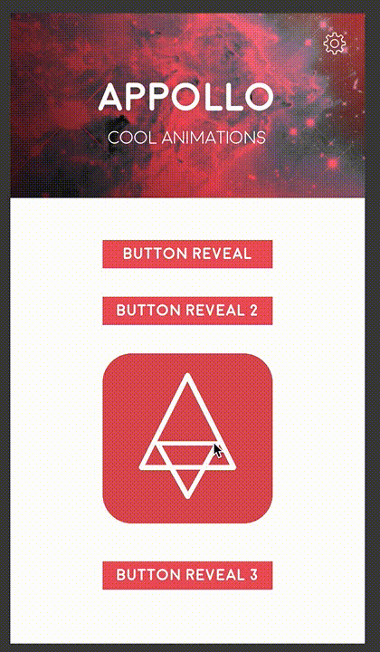

# Animated transitions for Xamarin.iOS 

You can find a lot of animated transitions for iOS on the web, but most of them are written either in Objective-C or Swift. This library contains a small amount of cool transitions, ported to C# for Xamarin.iOS.

There is some sample code available, currenyly the MvvmCross 5 sample "Cool Animations" is up-to-date. I am working hard to bring more samples and more transitions into this library.


## Usage
- TODO: With Xamarin.iOS
- With [MvvmCross](#MvvmCross)

## Transitions

### ImageRevealTransition



### CircleButtonRevealTransition


## <a name="MvvmCross"></a>Using transitions with MvvmCross

Add the nuget package "Redhotminute.Plugin.iOS.AnimatedTransitions" to your iOS project. 

Create start and a target MxvViewController, create bindings, viewmodels, etc, make sure the navigation between the ViewControllers work.

For all transitions:

- The starting ViewController should be of type IStartAnimationViewController.
- The target ViewController should be of type IEndAnimationViewController

### Start ViewController

In the start ViewController:

```
private CGRect _startingFrame;
public CGRect StartingFrame
{
	set { this._startingFrame = value; }
	get { return this._startingFrame; }
}
```

```
RevealButton.TouchUpInside += (sender, e) =>
{
	StartingFrame = RevealButton.Frame;
	((StartViewModel)ViewModel).NavigateToTargetViewCommand.Execute(null);
};
```

This can be simplified if you have only one transition on the start ViewController. Just create a binding for the navigation as you would normally do and add this to your code:

```
public CGRect StartingFrame
{
	get { return uiview.Frame }
}
```


### CenterPointRevealTransition

Add the TransitioningDelegate to the target ViewController. I have done this both in ViewDidLoad and in the constructor, both seems to work. 

```
TransitioningDelegate = new CircleButtonRevealTransitioningDelegate(.5f);
```

### CircleButtonRevealTransition

Set speed and background color of target view.

```
TransitioningDelegate = new CenterPointRevealTransitioningDelegate(.5f, UIColor.FromRGB(244, 198, 249));
```


## TODO
- Add more transitions
- Dive into interactive transitions
- Add multiple parameters (open vs close duration), open vs close alpha

## Inspiration, Docs, Links

* http://mathewsanders.com/custom-menu-transitions-in-swift/
* https://www.raywenderlich.com/86521/how-to-make-a-view-controller-transition-animation-like-in-the-ping-app
* https://www.raywenderlich.com/146692/ios-animation-tutorial-custom-view-controller-presentation-transitions-2
* https://www.raywenderlich.com/110536/custom-uiviewcontroller-transitions
* https://github.com/andreamazz/BubbleTransition
* https://github.com/onmyway133/fantastic-ios-animation/blob/master/Animation/transition.md
* https://github.com/ameizi/awesome-ios-animation
* https://github.com/recruit-mp/RMPZoomTransitionAnimator/blob/master/Pod/Classes/RMPZoomTransitionAnimator.m
* https://medium.com/@samstone/create-custom-uinavigationcontroller-transitions-in-ios-1acd6a0b6d25

## License
None as of now. 